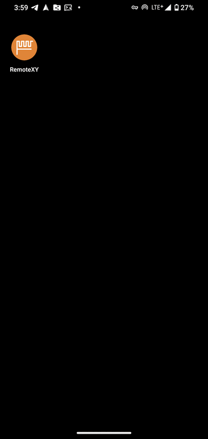
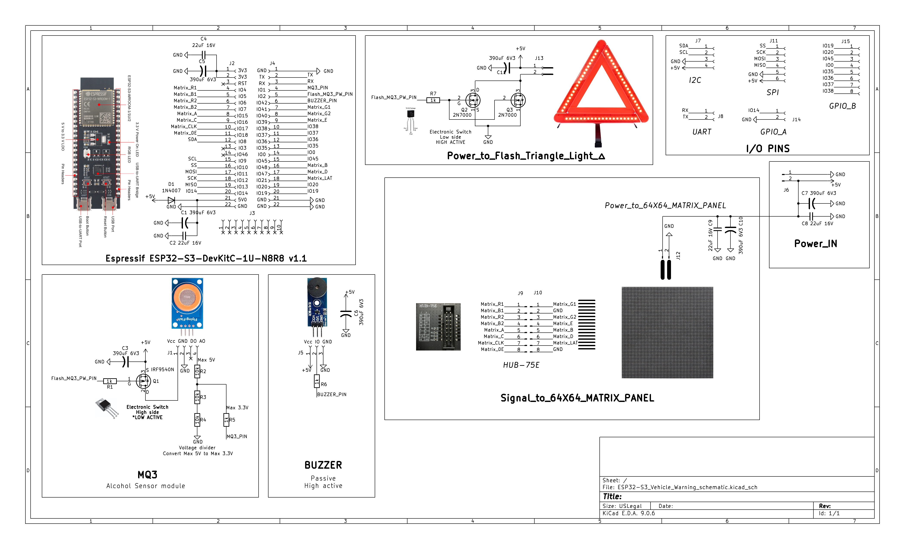
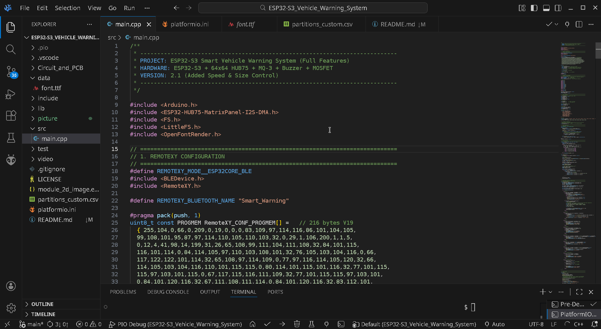
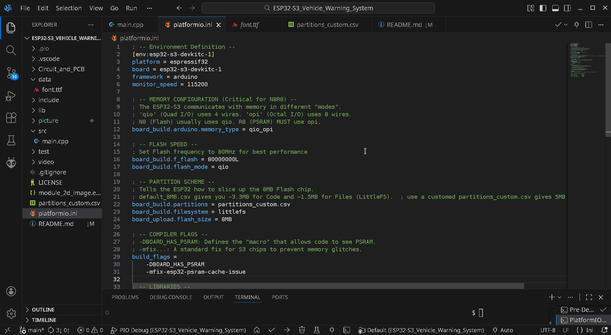
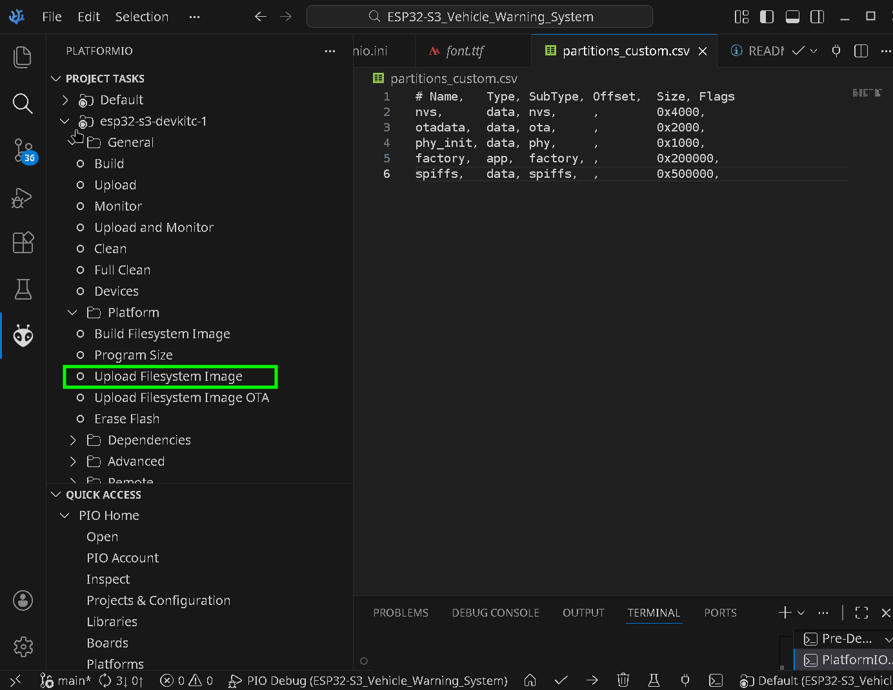
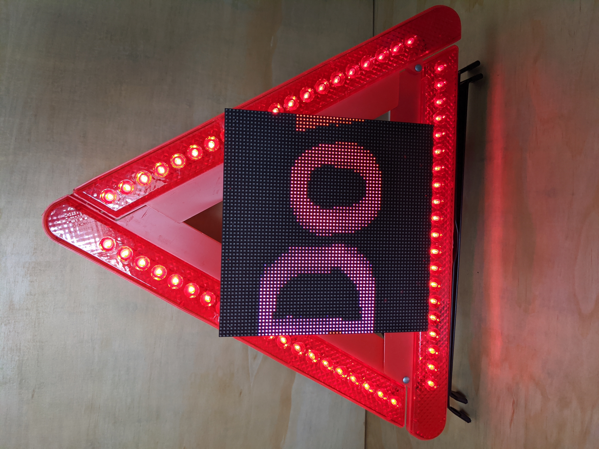
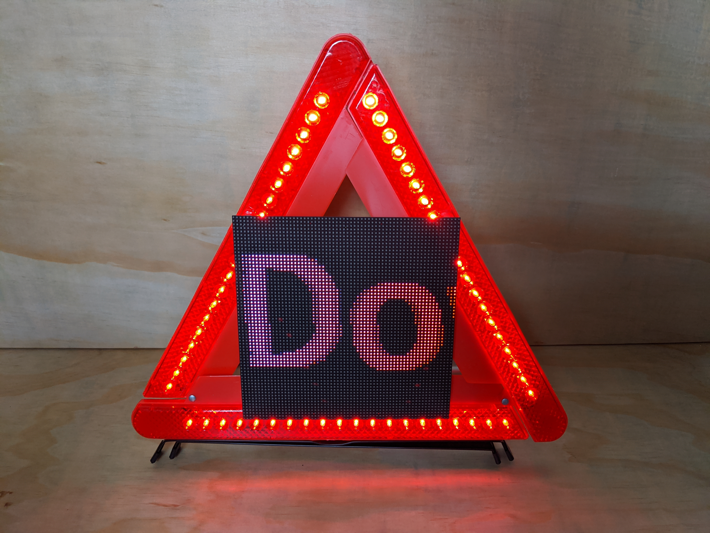
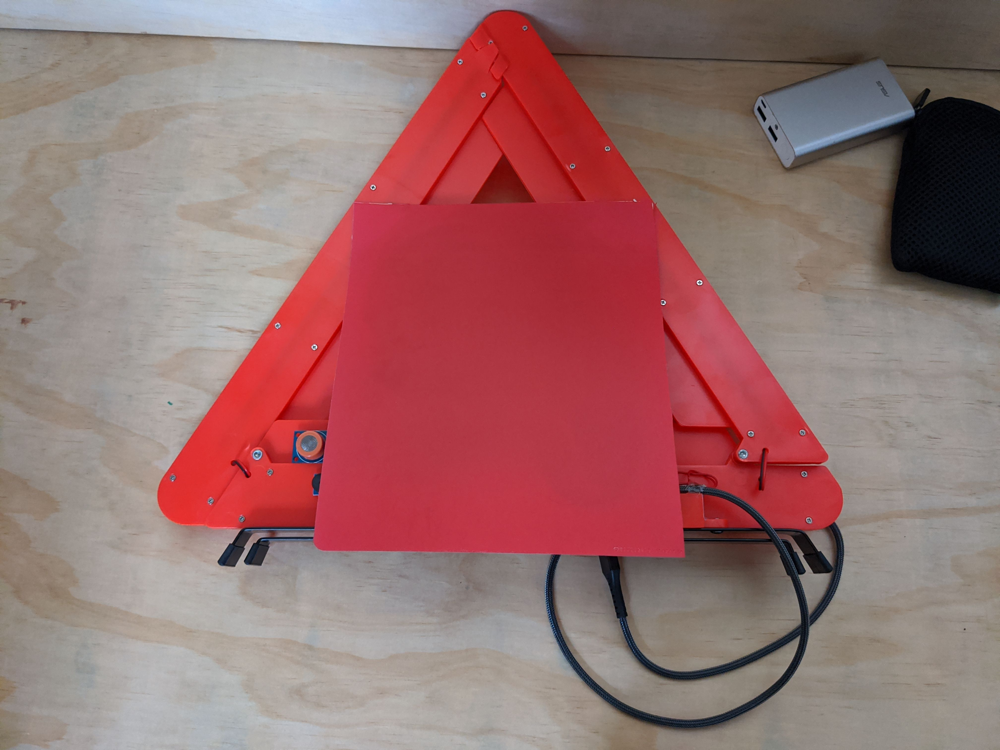
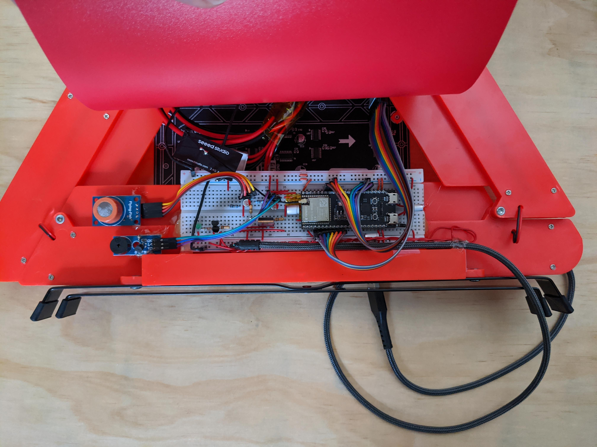
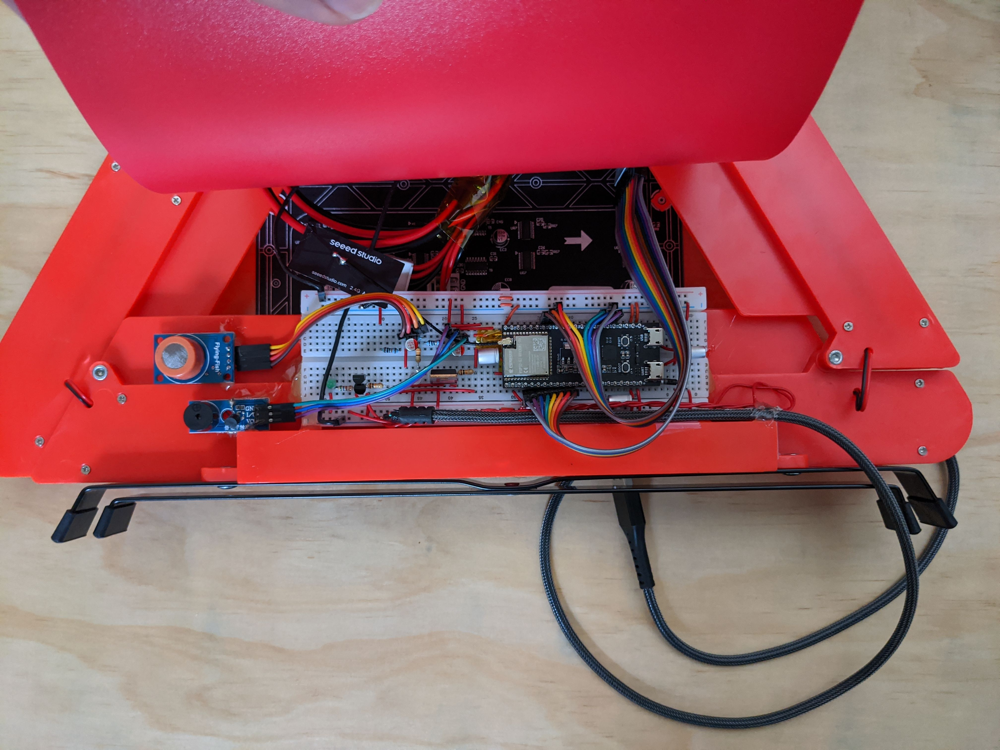

# ESP32-S3 Vehicle Warning System

An electronic warning triangle for a car that has broken down. A 64x64 LED matrix shows the warning text, an MQ-3 sensor can check the driver's breath for alcohol, and everything is set from a phone over Bluetooth with the RemoteXY app - so nobody has to walk onto the road to put the triangle in place.

It combines three smaller projects of mine:

- [ESP32-S3-MQ3-Alcohol-Sensor](https://github.com/waitingate/ESP32-S3-MQ3-Alcohol-Sensor) - reading and calibrating the MQ-3
- [ESP32-S3-Chinese-Traditional-LED-Matrix](https://github.com/waitingate/ESP32-S3-Chinese-Traditional-LED-Matrix) - scrolling Chinese text on the matrix
- [ESP32-S3_RemoteXY_BLE_LED_Control](https://github.com/waitingate/ESP32-S3_RemoteXY_BLE_LED_Control) - phone control over Bluetooth

## Hardware

- ESP32-S3-DevKitC-1U-N8R8 (8 MB flash, 8 MB PSRAM)
- Waveshare RGB-Matrix-P3-64x64 (HUB75E)
- MQ-3 alcohol sensor module
- passive buzzer and an LED strip for the triangle light
- 5 V 2 A power bank

The schematic is a KiCad 9 project in `hardware/` (open `ESP32-S3_Vehicle_Warning_schematic.kicad_pro`):

Also in `hardware/`:

- `wiring_diagram.png` - how the modules connect to the board (editable source: `wiring_diagram.excalidraw`)
- `size_overview.png` - sizes: the triangle is 38 cm high, the matrix 19 cm
- `simulation/` - Multisim 14 circuits for the high-side and low-side power switches and the LED switch

### Pins

| Part | Signal | GPIO |
| --- | --- | --- |
| HUB75 matrix | R1, G1, B1 | 4, 41, 5 |
| | R2, G2, B2 | 6, 40, 7 |
| | A, B, C, D, E | 15, 48, 16, 47, 39 |
| | LAT, OE, CLK | 21, 18, 17 |
| MQ-3 | analog out | 1 |
| Sensor / light switch | LOW = sensor on, HIGH = triangle light on | 2 |
| Buzzer | PWM | 42 |
| On-board RGB LED | | 38 |

The sensor and the triangle light share GPIO 2, so only one of them is on at a time: turning the light on switches the sensor off.

## The app

One menu with nine items; the two arrow buttons change the value of the selected item.

| Menu item | What it does |
| --- | --- |
| Alcohol Tester | reading in mg/L or PPM, or sensor off |
| Triangle Light | LED strip on / off |
| Buzzer Alarm | volume 0-100 % in steps of 10 |
| Matrix Brightness | 0-255 in steps of 10 |
| Preset Messages | 9 built-in messages: accident, breakdown, temporary stop, road work, traffic jam, fog, keep distance, S.O.S., system check |
| Custom Message | your own text, Chinese or English |
| Text Color | rainbow or one of 9 colours |
| Text Speed | 1 (slow) to 10 (fast) |
| Text Size | 8 to 60 px, default 48 |

After connecting, the app starts on Alcohol Tester. All 37 steps of the demo above are also in `images/app_demo/screenshots/`.

## Building

1. Install VS Code with the PlatformIO extension and clone this repo.
2. Open the folder in PlatformIO. `platformio.ini` already sets the board (`esp32-s3-devkitc-1`), the octal PSRAM and the partition table.
3. Build and upload.

### Upload the font once

The text is drawn with a TrueType font stored in the board's flash. `data/font.ttf` is a cut-down Taipei Sans TC with the 4808 common Traditional Chinese characters (Ministry of Education list), ASCII and a few symbols; `partitions_custom.csv` gives it 5 MB.

In the PlatformIO sidebar: `esp32-s3-devkitc-1` > Platform > Upload Filesystem Image.

Without the font the matrix stays dark. `FS Fail` in the serial monitor (115200 baud) means the file system could not be mounted; check that `platformio.ini` still uses `partitions_custom.csv`.

## Notes

- Bluetooth can react slowly while the text scrolls fast; the display refresh comes first.
- PlatformIO installs the libraries: ESP32 HUB75 LED MATRIX PANEL DMA Display, Adafruit GFX, OpenFontRender and RemoteXY.

## Photos

Video:

https://github.com/user-attachments/assets/b1d5552f-47cb-476c-b5d7-cf04c280354c

## License

MIT, see [LICENSE](LICENSE).
