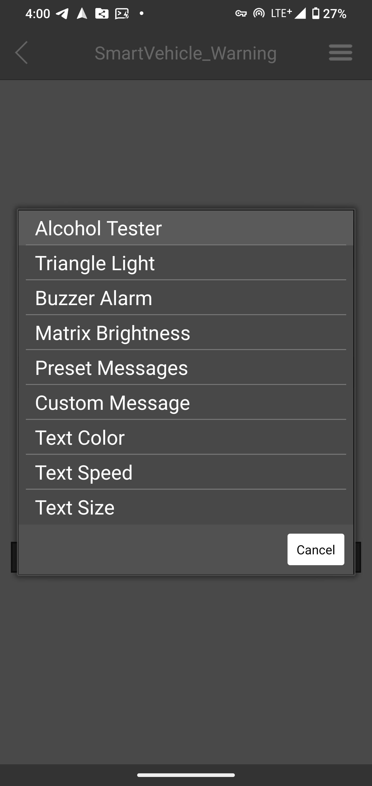
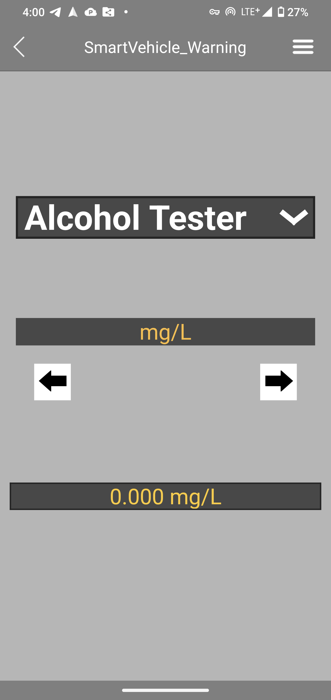

# Smart Vehicle Warning & Alcohol Detection System

This project leverages the powerful dual-core capabilities of the **ESP32-S3** to integrate a **64x64 HUB75 LED Matrix**, **MQ-3 Alcohol Sensor**, and **RemoteXY Bluetooth Control**. It creates an all-in-one smart vehicle safety device combining "Active Warning," "DUI Prevention," and "Remote Control."

The system is designed to solve the limitations of traditional warning triangles—such as **short visibility distance** due to passive reflection, the **high risk** of exiting the vehicle to place them, and **single-functionality**—effectively preventing secondary collisions.

---

## Repositories

The system was developed using a modular approach. Below are links to the individual modules and the final integrated version:

* **Final Integrated Version (Main Project)**
* **[ESP32-S3_Vehicle_Warning_System](https://github.com/waitingate/ESP32-S3_Vehicle_Warning_System)** - The complete system containing all features.


* **Sub-modules (Testing)**
* [ESP32-S3-MQ3-Alcohol-Sensor](https://github.com/waitingate/ESP32-S3-MQ3-Alcohol-Sensor) - Alcohol sensor ADC reading and calibration tests.
* [ESP32-S3-Chinese-Traditional-LED-Matrix](https://github.com/waitingate/ESP32-S3-Chinese-Traditional-LED-Matrix) - Traditional Chinese TTF font rendering and scrolling text tests.
* [ESP32-S3_RemoteXY_BLE_LED_Control](https://github.com/waitingate/ESP32-S3_RemoteXY_BLE_LED_Control) - Bluetooth interface control and menu logic tests.


---

## Project Structure

This project contains hardware schematics, software source code, and system resources. The directory structure is as follows:

```text
.
├── hardware/
│   ├── ESP32-S3_Vehicle_Warning_schematic.kicad_pro  # KiCad Project File (open this in KiCad 9)
│   ├── ESP32-S3_Vehicle_Warning_schematic.kicad_sch  # KiCad Schematic Source File
│   ├── ESP32-S3_Vehicle_Warning_schematic.png        # Schematic Preview Image
│   ├── wiring_diagram.excalidraw                     # System Connection Diagram (Excalidraw source)
│   ├── wiring_diagram.png                            # System Connection Diagram (image)
│   ├── size_overview.png                             # Device size: 38 cm triangle, 19 cm 64x64 matrix
│   └── simulation/                                   # Multisim 14 circuits (power switches, LED switch)
├── images/
│   ├── app_demo/                                     # App demo GIF + the 37 step screenshots
│   ├── photos/                                       # Photos of the finished device
│   └── setup/                                        # PlatformIO setup screenshots
├── data/
│   └── font.ttf                                      # Pre-optimized Font File (Includes 4808 common Chinese chars)
├── src/
│   └── main.cpp                                      # Main Source Code
├── partitions_custom.csv                             # Custom Partition Table (Allocates 5MB Flash for fonts)
├── platformio.ini                                    # PlatformIO Project Configuration File
├── LICENSE                                           # MIT License
└── README.md                                         # Project Documentation
```

---

## Table of Contents

1. [Motivation & Background](#motivation--background)
2. [System Functionality](#system-functionality)
3. [Hardware Architecture](#hardware-architecture)
4. [Software Architecture](#software-architecture)
5. [Installation Guide](#installation-guide)
6. [Font Upload Guide](#font-upload-guide) **(Crucial Step)**
7. [Operation Manual](#operation-manual)
8. [Gallery & Demo](#gallery--demo)

---

## Motivation & Background

1. **Solving "Secondary Collisions":** Traditional warning triangles rely on passive reflection, making them hard to see in rain, fog, or at night. Furthermore, they cannot convey specific information (e.g., Breakdown vs. Medical Emergency).
2. **Reducing Operational Risk:** Drivers risk their lives walking into traffic to place traditional triangles.
3. **The Solution:** A combination of Active LED Warning, Bluetooth Remote Control (stay inside the car), and Alcohol Detection.

---

## System Functionality

The system is controlled via the **RemoteXY** App over Bluetooth, featuring an intuitive menu-driven interface.

### App Interface Preview

 

*(Above: RemoteXY Bluetooth interface showing the function menu and an Alcohol reading)*

| Selector | Function | Details |
| --- | --- | --- |
| **1. Alcohol Tester** | **Alcohol Detector** | Supports **mg/L** and **PPM** units. When active, the Warning Light is forced OFF (Interlock). |
| **2. Triangle Light** | **Warning Triangle** | Controls the external LED strip (ON/OFF). |
| **3. Buzzer Alarm** | **Audio Alarm** | PWM linear volume control (0% ~ 100%). |
| **4. Matrix Brightness** | **Brightness** | Adjusts LED Matrix brightness (0% ~ 100%). |
| **5. Preset Messages** | **Preset Warnings** | Cycle through 9 modes: Accident, Breakdown, Temp Stop, Road Work, Fog Mode, SOS, etc. |
| **6. Custom Message** | **Custom Text** | Type any Traditional Chinese/English text to scroll instantly. |
| **7. Text Color** | **Text Color** | Switch between Rainbow, Red, Yellow, Green, Blue, White, etc. |
| **8. Text Speed** | **Scroll Speed** | Adjust scrolling speed (Level 1 ~ 10). |
| **9. Text Size** | **Text Size** | Dynamically adjust font size (8px ~ 60px). |

---

## Hardware Architecture

### Circuit Schematic (KiCad)


*(Above: Complete circuit schematic including ESP32-S3, HUB75 interface)*

* KiCad source: [`hardware/ESP32-S3_Vehicle_Warning_schematic.kicad_pro`](hardware/ESP32-S3_Vehicle_Warning_schematic.kicad_pro)
* Wiring diagram: [`hardware/wiring_diagram.png`](hardware/wiring_diagram.png) (editable source: `wiring_diagram.excalidraw`, open at excalidraw.com)
* Device size and layout: [`hardware/size_overview.png`](hardware/size_overview.png)
* Circuit simulations (Multisim 14): [`hardware/simulation/`](hardware/simulation/) - high-side and low-side power switches, LED switch circuit

### Core Specifications

* **MCU**: Espressif **ESP32-S3-DevKitC-1U-N8R8**
* **Display**: 64x64 RGB HUB75 LED Matrix (P3)
* **Sensor**: MQ-3 Alcohol Gas Sensor
* **Power**: 5V 2A Power Bank + Independent Filtering Circuit

### Pin Mapping

| Module | Pin Name | ESP32-S3 GPIO | Note |
| --- | --- | --- | --- |
| **HUB75** | R1/G1/B1 | 4/41/5 | Data Lines (upper half) |
|  | R2/G2/B2 | 6/40/7 | Data Lines (lower half) |
|  | A/B/C/D/E | 15/48/16/47/39 | Row Select |
|  | LAT/OE/CLK | 21/18/17 | Control |
| **Control** | **Shared Control** | **GPIO 2** | **Interlock Control** (LOW = Alcohol Sensor on, HIGH = Triangle Light on) |
| **Sensor** | MQ-3 ADC | GPIO 1 | Analog Input |
| **Audio** | Buzzer | GPIO 42 | PWM Output |
| **Status** | On-board RGB LED | GPIO 38 | NeoPixel |

---

## Software Architecture

* **Memory Optimization**: Uses `ps_calloc` to allocate graphics buffers in external PSRAM.
* **Smart Rendering**: Uses `OpenFontRender` to handle Traditional Chinese fonts.
* **Anti-Jamming**: Implements BLE Lazy Loading to prevent data congestion during sensor updates.
* **File System**: Uses LittleFS to store the font library.

---

## Installation Guide

1. Install **VS Code** and the **PlatformIO** extension.
2. `git clone` this repository.
3. Ensure drivers (CH343/CP210x) are installed on your computer.


---

## Font Upload Guide

**[IMPORTANT] This is the most critical step!**
The `data/` folder in this project comes with a pre-built **`font.ttf`**. This file has been optimized and includes:

* **Ministry of Education's 4808 Common Traditional Chinese Characters**
* **Common ASCII Characters**
* **Special Symbols (Degrees Celsius, Warning signs, Arrows, etc.)**

You **DO NOT** need to generate the font yourself. You simply need to upload it to the ESP32's Flash memory.

### Step 1: Upload via PlatformIO

1. Connect the ESP32-S3 to your computer.
2. Click the **PlatformIO Icon** (Alien head) in the VS Code sidebar.
3. In the **PROJECT TASKS** panel, expand:
* `esp32-s3-devkitc-1`
* `Platform`


4. Click **Upload Filesystem Image**.
5. PlatformIO will package the `data` folder and flash it to the board.


   

### Step 2: Verify

Once the terminal shows `SUCCESS`, restart the board. If the Serial Monitor shows `Font Loaded`, the system is ready.

---

## Operation Manual

1. **Startup**: Default mode is Alcohol Tester. Screen displays "Warming Up".
2. **Warning Mode**: Use the App to turn on the Triangle Light and select a Preset Message. The Alcohol Tester will power off automatically (Interlock).
3. **Customization**: You can change the text content, color, and size on the fly via the App.

---

## Gallery & Demo

### App Demo (Android, Google Pixel 4 XL)


The 37 steps as full-resolution screenshots: [`images/app_demo/screenshots/`](images/app_demo/screenshots/)

### Photos


### Live Demo Video


https://github.com/user-attachments/assets/b1d5552f-47cb-476c-b5d7-cf04c280354c


---

## Troubleshooting

* **Q: Screen is black/blank?** -> A: Please verify that you have performed the **Upload Filesystem Image** step to load the font.
* **Q: `Failed to mount LittleFS` error?** -> A: Check if `partitions_custom.csv` is correctly configured in `platformio.ini`.
* **Q: Bluetooth is laggy?** -> A: This is normal when the LED Matrix is refreshing at high speeds. The system prioritizes display stability.

---

*Created by [waitingate](https://github.com/waitingate)*
